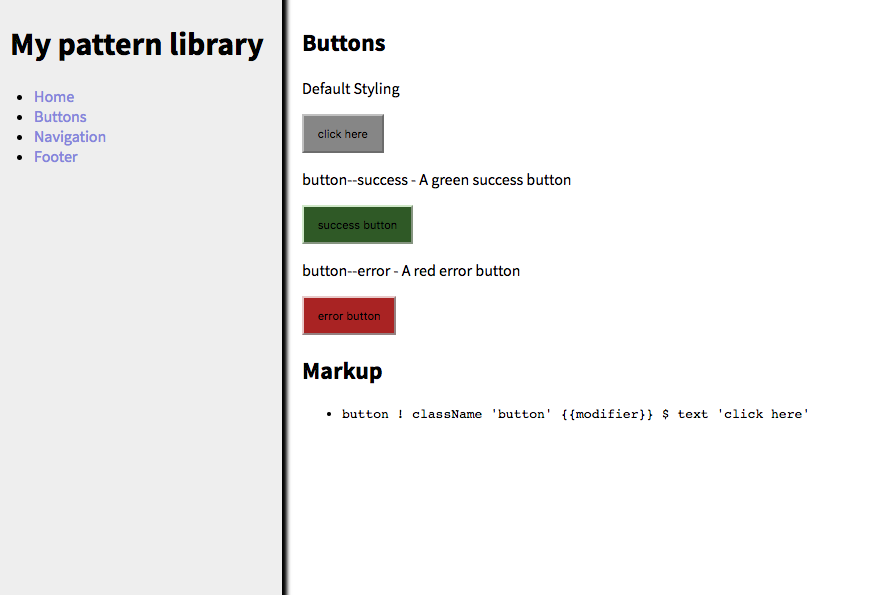

# pux-kss-pattern-library

Generate and document re-usable components in PureScript/Pux as Knyle Style Sheets (KSS).

[Smolder](https://github.com/bodil/purescript-smolder) markup is below the components.

Uses the [pux starter app](http://github.com/alexmingoia/pux-starter-app) for development. This includes isomorphic rendering, routing, hot-reloading, and a
production server.

## Example



## Installation

Clone the repository and run `npm install` to get started:

```sh
git clone git://github.com/janaipakos/pux-kss-pattern-library.git
cd pux-kss-pattern-library
npm install
npm start
```

After compiling the app should be available at `http://localhost:3000`.

### Directory structure

- `src`: Application source code.
  - `src/App/Config.js`: Configuration values.
  - `src/App/Config.purs`: Configuration type.
  - `src/App/Events.purs`: Application event type and foldp function.
  - `src/App/Routes.purs`: Routes.
  - `src/App/State.purs`: Application state type and init function.
  - `src/App/View/Button.purs`: Example component.
  - `src/App/View/HTMLWrapper.purs`: HTML document view.
  - `src/App/View/Homepage.purs`: Home page.
  - `src/App/View/Layout.purs`: App layout. Styles are stored here
  - `src/App/View/NotFound.purs`: 404 page.
  - `src/Server.purs`: Server entry point.
  - `src/Client.purs`: Client entry point.
- `static`: Static files served with application.
- `support`: Support files for building.
  - `support/client.entry.js`: Webpack entry point. Handles hot reloading.
  - `support/server.entry.js`: Webpack entry point. Handles hot reloading.
- `bower.json`: Bower package configuration.
- `package.json`: Node package configuration.
- `webpack.config.client.js`: Webpack client configuration.
- `webpack.config.server.js`: Webpack server configuration.

### NPM scripts

#### watch

`npm start` or `npm run watch` will start a development server, which
hot-reloads your application when sources changes.

#### serve

`NODE_ENV=production npm run serve` builds your application and starts a
production server.

#### build

`npm run build` builds application client and server bundles.
